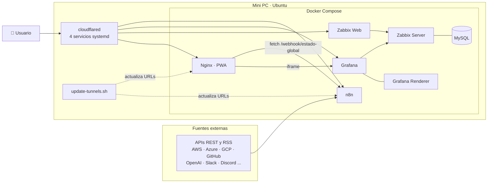

# 📡 Radar de Estado de Servicios Cloud + Stack de Monitorización

> Stack *self-hosted* en un Mini PC con Ubuntu que combina **automatización (n8n)**, **monitorización (Zabbix + Grafana)** y un **panel web PWA**, expuesto con **Cloudflare Tunnels** sin abrir puertos en el router.


<!--  -->

## 🎯 ¿Qué es?

Un proyecto de extremo a extremo que demuestra habilidades de **DevOps, automatización e integración de APIs**:

- **n8n** consulta APIs REST y feeds RSS/XML de AWS, Azure, Google Cloud, Cloudflare, GitHub, OpenAI, Slack, Discord, Atlassian y Google News.
- Un nodo combinador unifica los estados en un único JSON, expuesto en `/webhook/estado-global`.
- `radar.html` consume ese webhook y pinta el estado en tiempo real.
- **Zabbix** monitoriza la infraestructura y **Grafana** muestra los dashboards, embebidos en el panel principal.
- Todo se publica mediante **4 túneles Cloudflare**, con las URLs actualizadas automáticamente por un script.

## 🏗️ Arquitectura



## 🧰 Servicios

| Servicio | Imagen | Puerto | Función |
|---|---|---|---|
| n8n | `n8nio/n8n` | 5678 | Automatización y webhook de estado global |
| zabbix-db | `mysql:8.0` | – | Base de datos de Zabbix |
| zabbix-server | `zabbix-server-mysql` 6.4 | 10051 | Recolección de métricas |
| zabbix-web | `zabbix-web-nginx-mysql` 6.4 | 8080 | Interfaz de Zabbix |
| grafana | `grafana-oss` | 3000 | Dashboards (plugin Zabbix) |
| grafana-renderer | `grafana-image-renderer` | 8081 | Renderizado de paneles a imagen |
| app | `nginx:alpine` | 8090 | Sirve la PWA (`app/`) |

## ✨ Características clave

- **Agregación multi-fuente** en un único endpoint JSON.
- **Frontend sin frameworks:** HTML5, CSS3 y JavaScript nativo asíncrono.
- **PWA instalable:** `manifest.json`, `service-worker.js` e iconos.
- **Sin puertos abiertos en el router:** todo el acceso externo entra por túneles Cloudflare.
- **Auto-reconfiguración:** `update-tunnels.sh` lee las URLs de los servicios `cloudflared` (vía `journalctl`), actualiza `docker-compose.yml`, `index.html` y `radar.html`, y recrea el contenedor de n8n.
- **Persistencia** con volúmenes Docker nombrados (`n8n_data`, `zabbix_db_data`, `grafana_data`).

## 📁 Estructura

```text
.
├── app/
│   ├── index.html            # Panel principal (enlaces + dashboards Grafana)
│   ├── radar.html            # Radar de estado global
│   ├── manifest.json         # Manifiesto PWA
│   ├── service-worker.js
│   └── icon-*.png
├── docker-compose.example.yml  # Compose con variables de entorno
├── .env.example                # Plantilla de variables
├── update-tunnels.sh           # Actualización dinámica de túneles
└── README.md
```

## 🚀 Puesta en marcha

```bash
git clone https://github.com/mllacer27-prog/radar-monitoring-stack.git ~/stack && cd ~/stack

# 1. Variables de entorno
cp .env.example .env && nano .env

# 2. Compose (usa las variables del .env)
cp docker-compose.example.yml docker-compose.yml
docker compose up -d

# 3. Instalar cloudflared y crear un servicio systemd por túnel
#    https://developers.cloudflare.com/cloudflare-one/connections/connect-networks/downloads/

# 4. Actualizar URLs
chmod +x update-tunnels.sh && ./update-tunnels.sh
```

Después, importa tus flujos en n8n y configura tus propias credenciales.

> ⚠️ `update-tunnels.sh` modifica archivos por número de línea; si editas `docker-compose.yml`, `index.html` o `radar.html`, revisa que las líneas coincidan.

## 🔐 Seguridad y decisiones de diseño

- Secretos fuera del repositorio (`.env` ignorado por Git; se publica solo `.env.example`).
- Los datos de n8n (credenciales y clave de cifrado) viven en un volumen Docker y nunca se versionan.
- Grafana tiene acceso anónimo de solo lectura (*Viewer*) de forma deliberada, para poder embeber los dashboards en el panel.

## 🗺️ Mejoras futuras

- [ ] Publicar los puertos solo en `127.0.0.1` (los túneles corren en el mismo host).
- [ ] Sustituir `innerHTML` por `textContent` en `radar.html`.
- [ ] Migrar a *Named Tunnels* con dominio propio (URL estable, sin script).
- [ ] Automatizar la sustitución de URLs con plantillas en lugar de números de línea.
- [ ] CI/CD con GitHub Actions.

## 👤 Autor

**mllacer27-prog**: DevOps · Full-Stack
[GitHub](https://github.com/mllacer27-prog)

## 📄 Licencia

MIT
